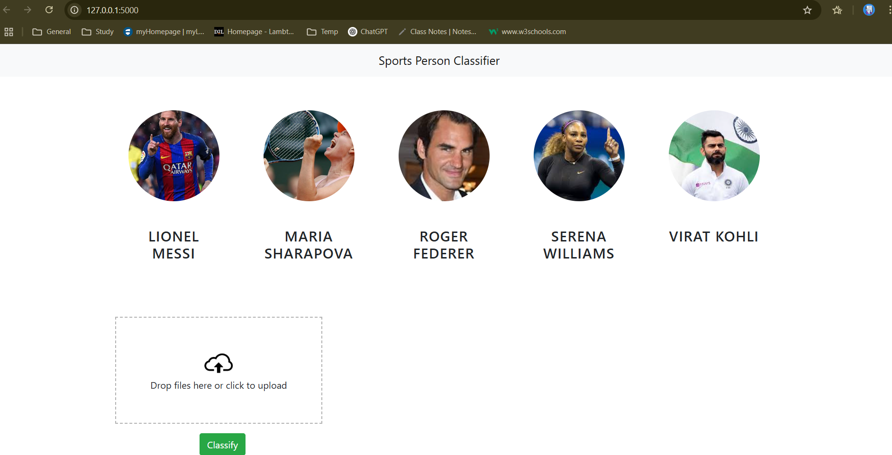
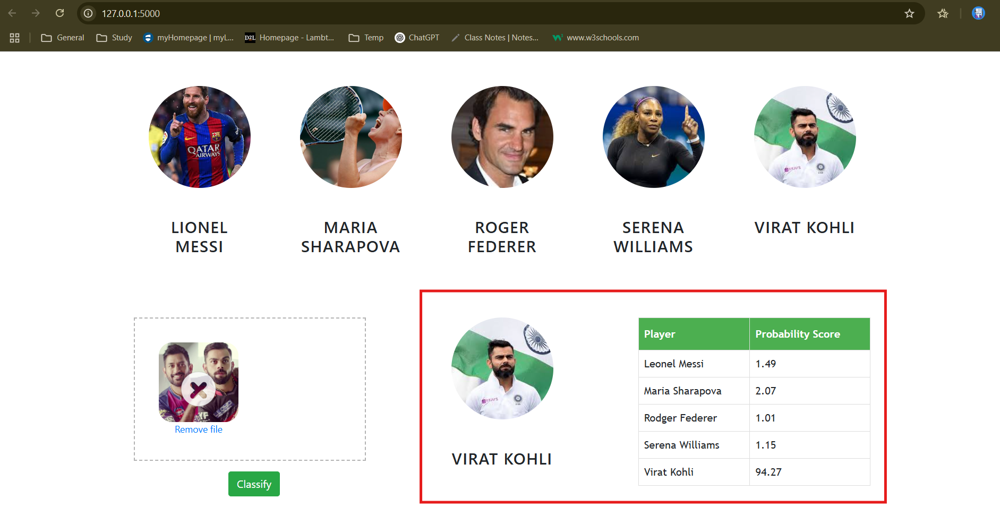

# 🏅 SportsPersonClassifierApp (ML Project)

This is a web application that classifies images of sports personalities using a pre-trained machine learning model.

---

## 🚀 Features

- Upload an image of a sportsperson
- Backend (Flask) predicts the name using a trained classifier
- Haar Cascade face detection & wavelet-based feature extraction
- Deployed on AWS EC2 with NGINX

---

## 📁 Project Structure

SportsPersonClassifierApp/
├── server/ # Backend: Flask app, ML logic
├── UI/ # Frontend: HTML/CSS/JS
├── model/ # Trained model and class dictionary
├── notebooks/ # Jupyter notebook for model training
├── requirements.txt # Project dependencies
└── README.md # You're reading it!

---

## 📊 Model & Tech Stack

- **Model(s)**: Support Vector Machine (SVM)(best), Logistic Regression, Random Forest
- **Preprocessing**: Haar Cascade for face detection, Wavelet Transform for feature extraction
- **Libraries**: NumPy, OpenCV, Scikit-learn, PyWavelets, Joblib
- **Frontend**: HTML, CSS, JavaScript
- **Backend**: Flask (Python)
- **Deployment**: AWS EC2 with NGINX

---

## 🧠 ML Training Details

📁 Dataset Classes
1) Virat Kohli
2) Roger Federer
3) Serena Williams
4) Maria Sharapova
5) Lionel Messi

🧪 Feature Extraction
Each face is processed using:

1. Haar Cascade for face detection

2. Wavelet Transform for texture feature extraction

The resulting features are flattened and concatenated with raw pixel values to form the final input vector for classification.

🔍 Model Selection
Used GridSearchCV for hyperparameter tuning across all models to identify the best-performing estimator.

---

## 🌍 Deployment

- Hosted on AWS EC2
- NGINX used to reverse proxy requests to Flask server
- Live Demo (when server is running):  
  🌐 http://ec2-18-222-20-156.us-east-2.compute.amazonaws.com/

---

## 💻 How to Run Locally

```bash
# 1. Clone this repository
git clone https://github.com/hetvis-pro/SportsPersonClassifierApp.git
cd SportsPersonClassifierApp

# 2. Install required dependencies
pip install -r requirements.txt

# 3. Run the Flask app
cd server
python server.py

# 4. Open your browser and go to:
http://127.0.0.1:5000/

```

📷 UI screenshots
1)App UI:

2)Output predictions:


<!-- 3)EC2 deployment running: -->

🙋‍♀️ Author
Hetvi
📧 hetvis.pro@gmail.com
🔗 https://www.linkedin.com/in/hetvi-sodha-pro/
